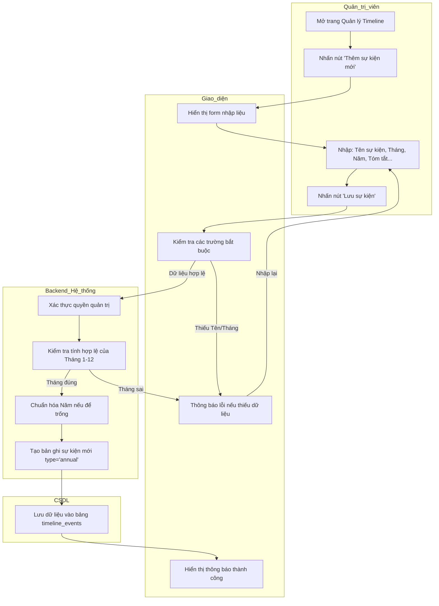

# CÁC BIỂU ĐỒ HOẠT ĐỘNG (ACTIVITY DIAGRAMS)

Tài liệu này mô tả các luồng quy trình nghiệp vụ chi tiết của hệ thống dưới dạng phân làn (swimlane).

---

### 1. **TẠO CARD SỰ KIỆN HÀNG NĂM TRONG TIMELINE**

