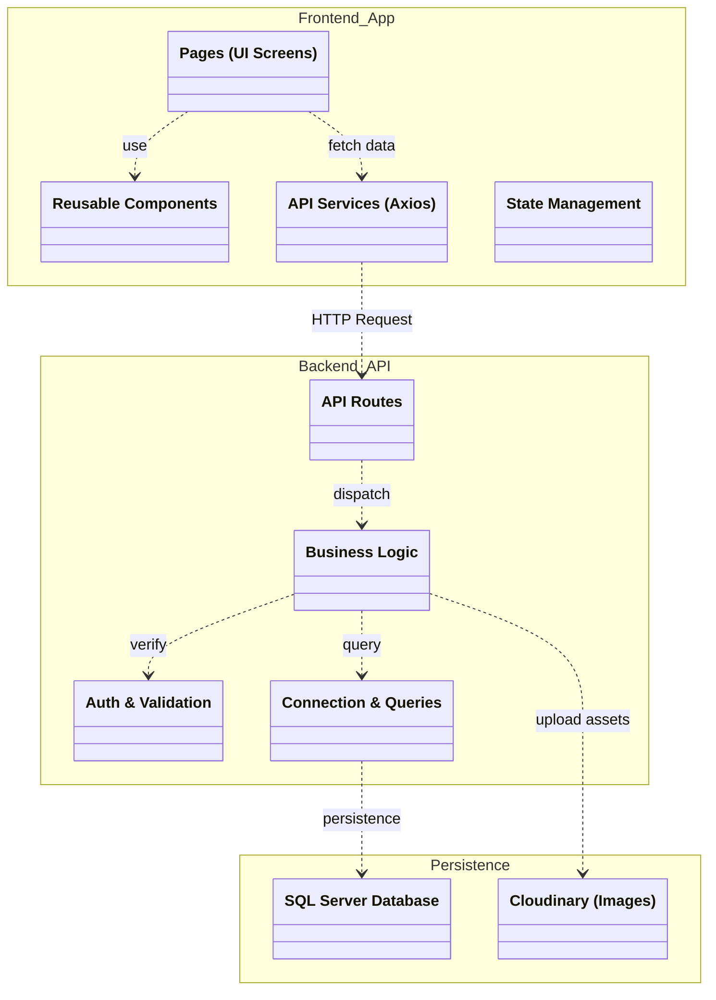
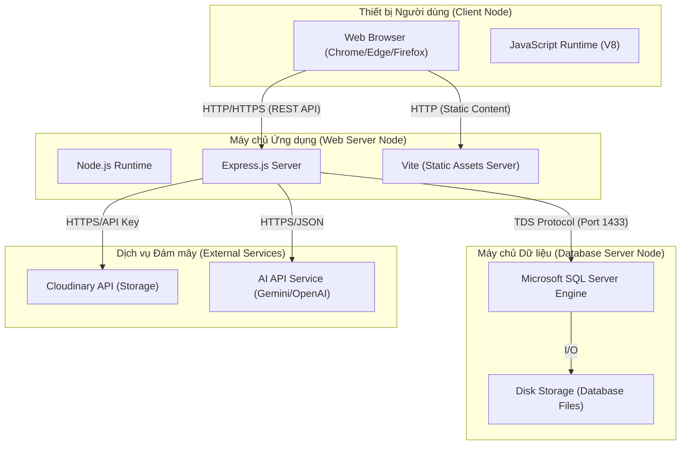

# Biểu đồ Kiến trúc Hệ thống (Architecture Diagrams)

Tài liệu này chứa các biểu đồ kiến trúc cấp cao của hệ thống Web LCD, được xây dựng dựa trên tiêu chuẩn Phân tích Thiết kế Hệ thống (PTTKHT).

---

### 1. Biểu đồ Gói (Package Diagram)

Biểu đồ này thể hiện cấu trúc phân tầng và sự phụ thuộc giữa các thành phần logic trong codebase (Frontend React và Backend Node.js).

---

### 2. Biểu đồ Triển khai (Deployment Diagram)

Biểu đồ này mô tả môi trường vận hành vật lý của hệ thống, bao gồm các thiết bị đầu cuối, máy chủ ứng dụng và máy chủ cơ sở dữ liệu.

---

**Ghi chú:**
- **Package Diagram:** Thể hiện sự tách biệt giữa tầng Giao diện (Frontend) và tầng Xử lý (Backend).
- **Deployment Diagram:** Thể hiện mô hình 3 lớp (3-Tier Architecture) truyền thống với sự hỗ trợ của các dịch vụ Cloud bên thứ ba.
