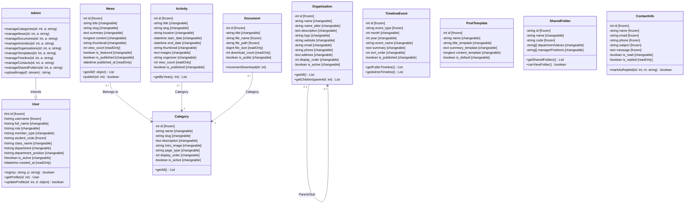

# BIỂU ĐỒ LỚP CHI TIẾT (MERMAID CLASS DIAGRAM) - BẢN ĐẦY ĐỦ NHẤT

```mermaid
classDiagram
    class User {
        #int id [frozen]
        #string username [frozen]
        #string full_name [changeable]
        #string role [changeable]
        #string member_type [changeable]
        #string student_code [frozen]
        #string class_name [changeable]
        #string department [changeable]
        #string department_position [changeable]
        #boolean is_active [changeable]
        #datetime created_at [readOnly]
        +login(u: string, p: string) boolean
        +getProfile(id: int) User
        +updateProfile(id: int, d: object) boolean
    }

    class Admin {
        +manageCategories(id: int, a: string)
        +manageNews(id: int, a: string)
        +manageDocuments(id: int, a: string)
        +manageActivities(id: int, a: string)
        +manageOrganizations(id: int, a: string)
        +manageTemplates(id: int, a: string)
        +manageTimeline(id: int, a: string)
        +manageContacts(id: int, a: string)
        +manageSharedFolders(id: int, a: string)
        +uploadImage(f: stream) string
    }

    class Organization {
        -int id [frozen]
        -string name [changeable]
        -string name_abbr [changeable]
        -text description [changeable]
        -string logo [changeable]
        -string website [changeable]
        -string email [changeable]
        -string phone [changeable]
        -text address [changeable]
        -int display_order [changeable]
        -boolean is_active [changeable]
        +getAll() List
        +getChildren(parentId: int) List
    }

    class News {
        -int id [frozen]
        -string title [changeable]
        -string slug [changeable]
        -text summary [changeable]
        -longtext content [changeable]
        -string thumbnail [changeable]
        -int view_count [readOnly]
        -boolean is_featured [changeable]
        -boolean is_published [changeable]
        -datetime published_at [readOnly]
        +getAll(f: object) List
        +publish(id: int) boolean
    }

    class Activity {
        -int id [frozen]
        -string title [changeable]
        -string slug [changeable]
        -string location [changeable]
        -datetime start_date [changeable]
        -datetime end_date [changeable]
        -string thumbnail [changeable]
        -text images [changeable]
        -string organizer [changeable]
        -int view_count [readOnly]
        -boolean is_published [changeable]
        +getByYear(y: int) List
    }

    class Document {
        -int id [frozen]
        -string title [changeable]
        -string file_name [frozen]
        -string file_path [frozen]
        -bigint file_size [readOnly]
        -int download_count [readOnly]
        -boolean is_public [changeable]
        +incrementDownload(id: int)
    }

    class TimelineEvent {
        -int id [frozen]
        -string event_type [frozen]
        -int month [changeable]
        -int year [changeable]
        -string event_name [changeable]
        -text summary [changeable]
        -int sort_order [changeable]
        -boolean is_published [changeable]
        +getPublicTimeline() List
        +getAdminTimeline() List
    }

    class Category {
        -int id [frozen]
        -string name [changeable]
        -string slug [changeable]
        -text description [changeable]
        -string intro_image [changeable]
        -string page_type [changeable]
        -int display_order [changeable]
        -boolean is_active [changeable]
        +getAll() List
    }

    class PostTemplate {
        -int id [frozen]
        -string name [changeable]
        -string title_template [changeable]
        -text summary_template [changeable]
        -longtext content_template [changeable]
        -boolean is_default [changeable]
    }

    class SharedFolder {
        -string id [frozen]
        -string name [changeable]
        -string code [frozen]
        -string[] departmentValues [changeable]
        -string[] managerPositions [changeable]
        +getSharedFolders() List
        +canViewFolder() boolean
    }

    class ContactInfo {
        -int id [frozen]
        -string name [frozen]
        -string email [frozen]
        -string phone [frozen]
        -string subject [frozen]
        -text message [frozen]
        -boolean is_read [changeable]
        -boolean is_replied [readOnly]
        +markAsReplied(id: int, m: string) boolean
    }

    Admin --|> User : Inherits
    News "0..*" --> "1" Category : Belongs to
    Activity "0..*" --> "1" Category : Category
    Document "0..*" --> "1" Category : Category
    Organization "0..1" --> "0..*" Organization : Parent/Sub
```
