# CÁC BIỂU ĐỒ TRÌNH TỰ (SEQUENCE DIAGRAMS) - CHI TIẾT NGHIỆP VỤ

Tài liệu này mô tả chi tiết các luồng tương tác giữa **Người dùng**, **Các màn hình giao diện**, **Bộ điều khiển (Controller)** và **Cơ sở dữ liệu** dựa trên kiến trúc thực tế của hệ thống.

---

## I. PHÂN HỆ QUẢN TRỊ (WEB ADMIN)

### 1. Đăng nhập hệ thống (Chi tiết nghiệp vụ)
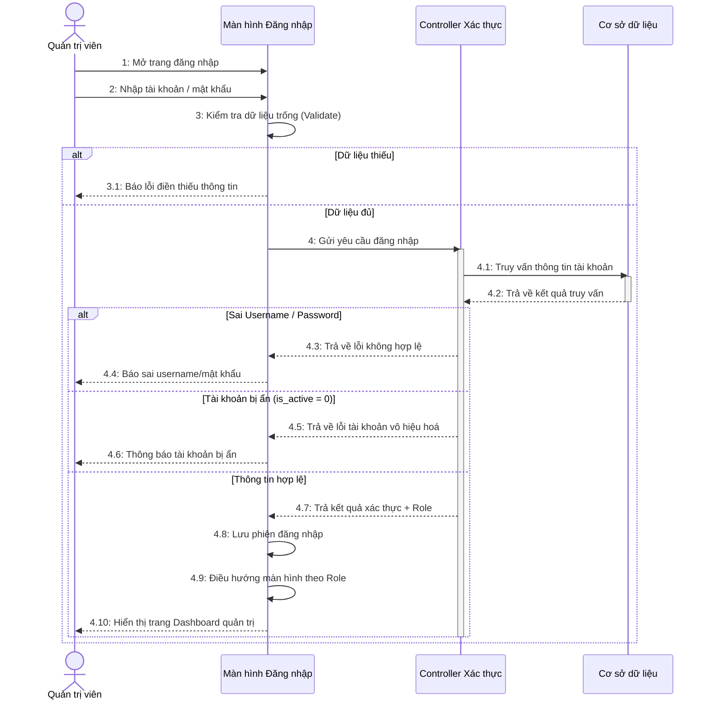

### 2. Tạo bài viết mới (Hỗ trợ AI & Template)
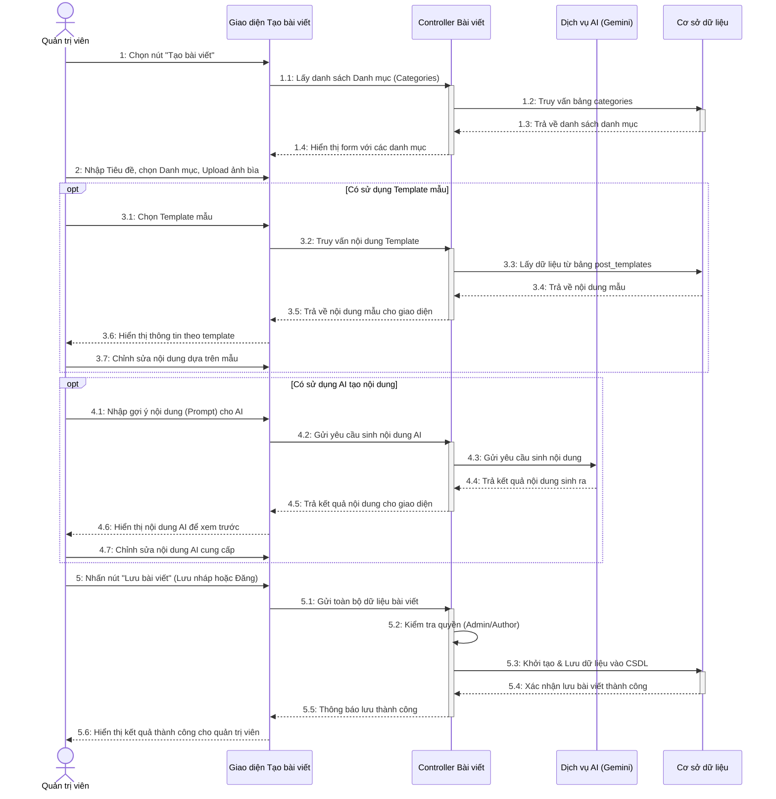

### 3. Cập nhật bài viết
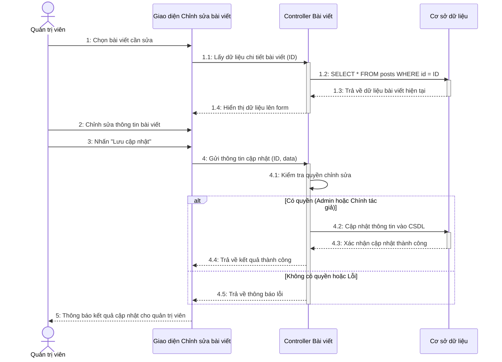

### 4. Xoá bài viết
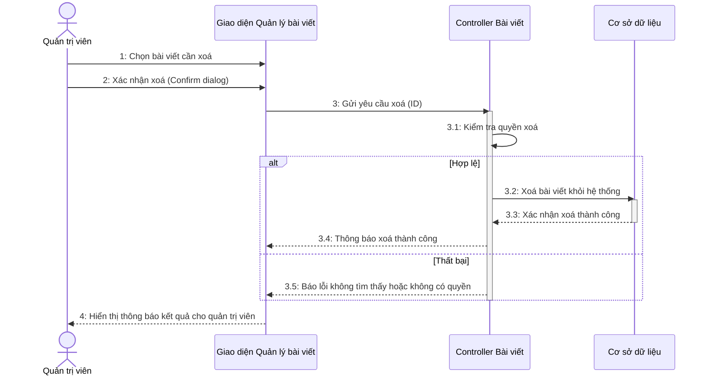

### 5. Duyệt và xuất bản bài viết
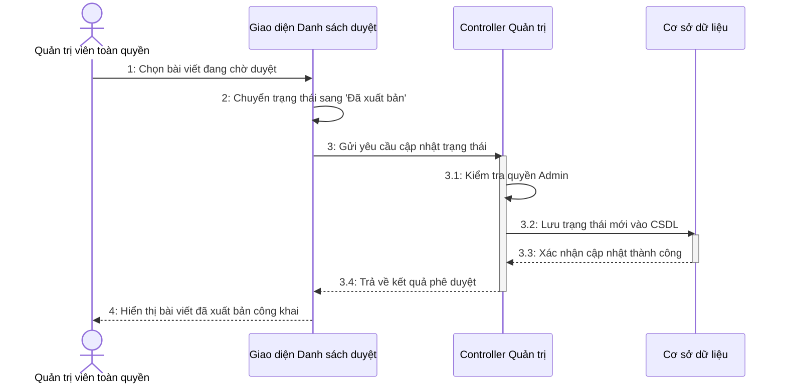

### 6. Tạo danh mục mới
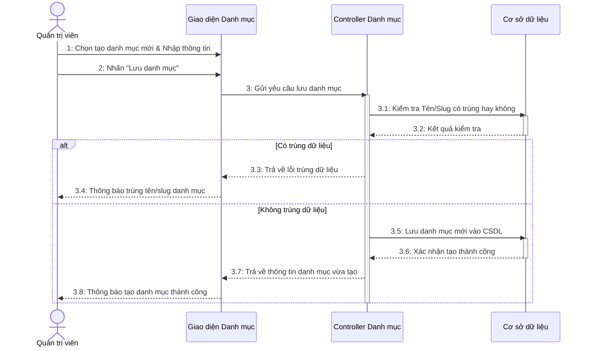

### 7. Tạo thành viên mới
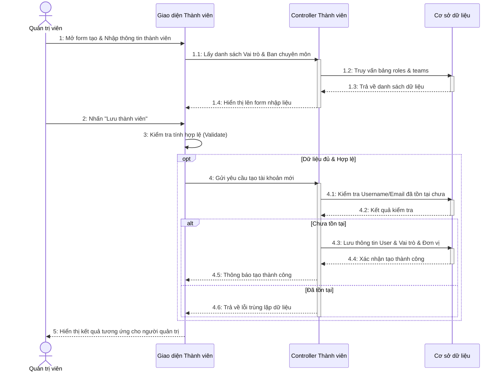

### 8. Xuất Giấy mời/Chứng chỉ hàng loạt
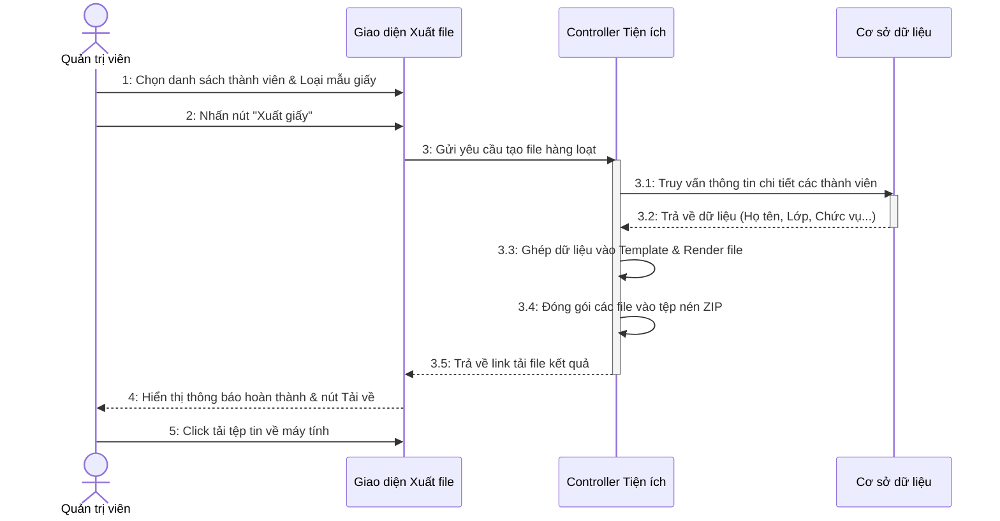

### 9. Upload file lên thư mục chung
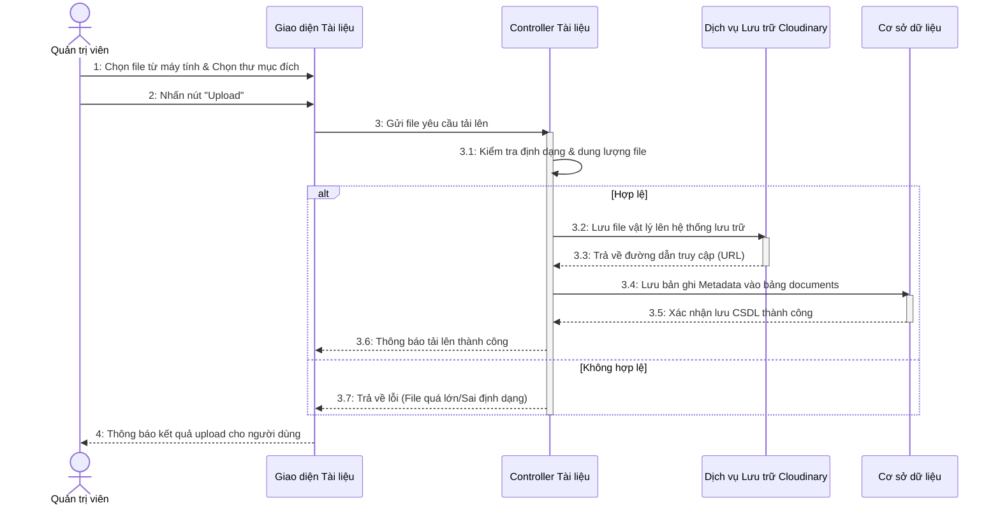

### 10. Tạo sự kiện mới cho Timeline
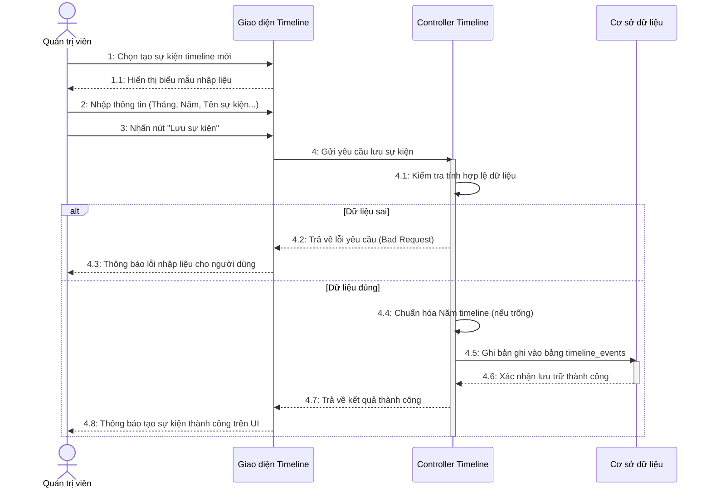

## II. PHÂN HỆ NGƯỜI DÙNG (CLIENT)

### 11. Xem chi tiết bài viết (Người dùng)
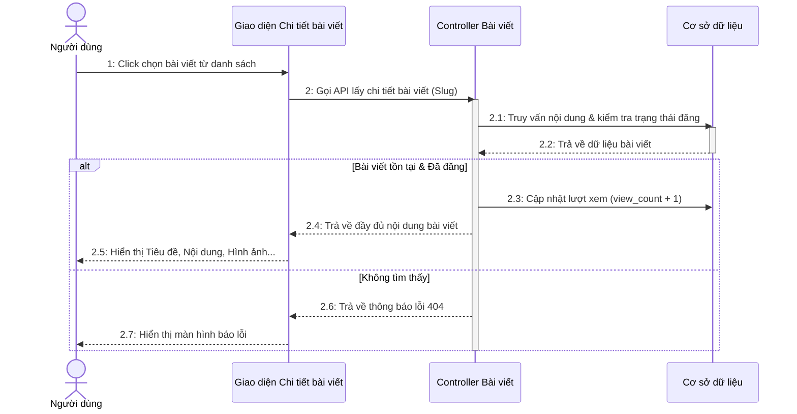

### 12. Tìm kiếm bài viết (Người dùng)
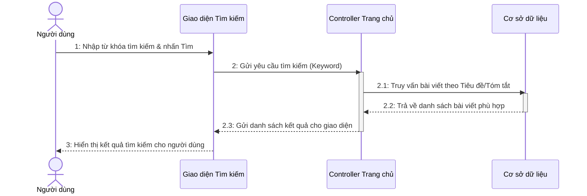
