# CÁC BIỂU ĐỒ TRÌNH TỰ (SEQUENCE DIAGRAMS) - CHI TIẾT NGHIỆP VỤ

Tài liệu này mô tả chi tiết các luồng tương tác giữa **Người dùng (Actor)**, **Giao diện**, và **Backend** dựa trên logic thực tế của Codebase và Biểu đồ hoạt động.

---

### 1. **TẠO THÀNH VIÊN MỚI**

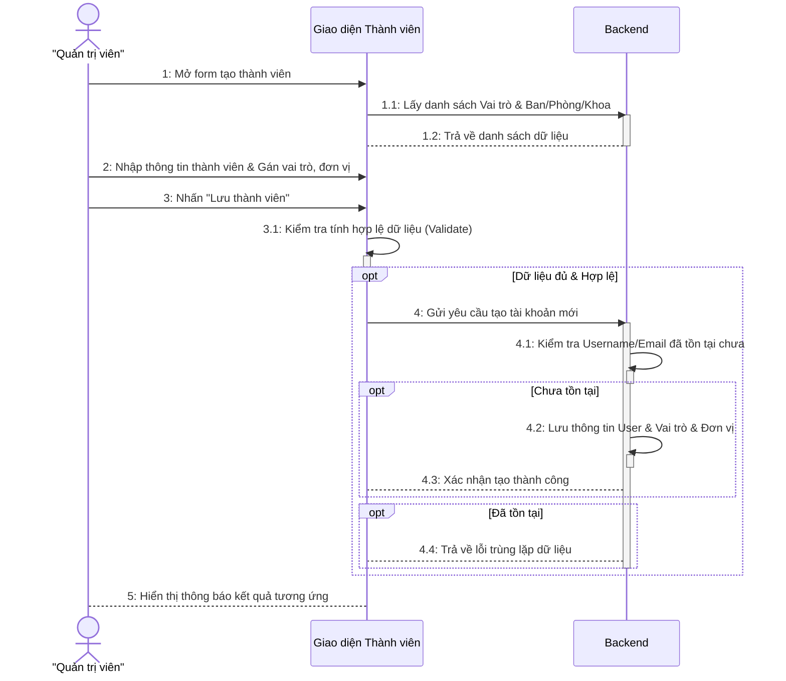

---

### 2. **CẬP NHẬT 1 BÀI VIẾT**

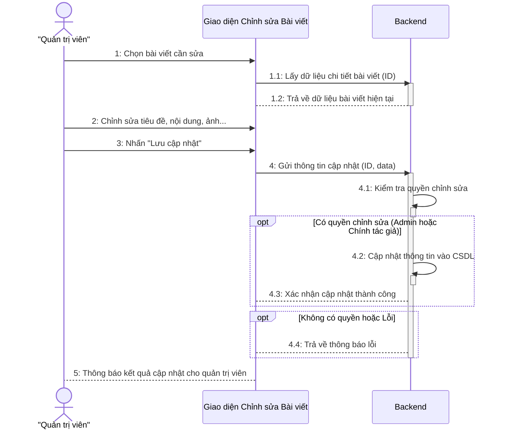

---

### 3. **XOÁ 1 BÀI VIẾT**

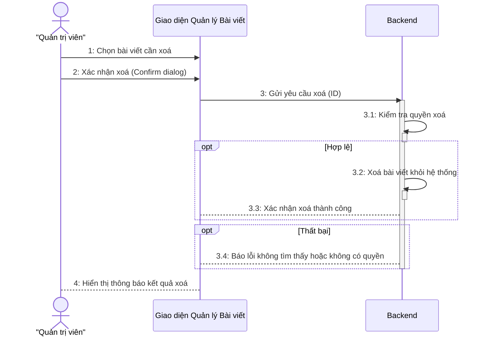

---

### 4. **XUẤT GIẤY MỜI/GIẤY CHỨNG NHẬN HÀNG LOẠT**

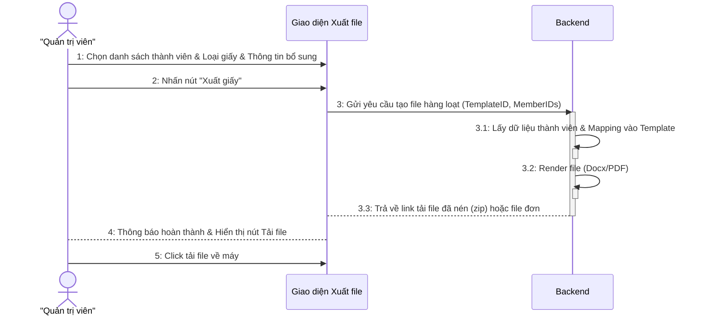

---

### 5. **UPLOAD 1 FILE LÊN FOLDER CHUNG**

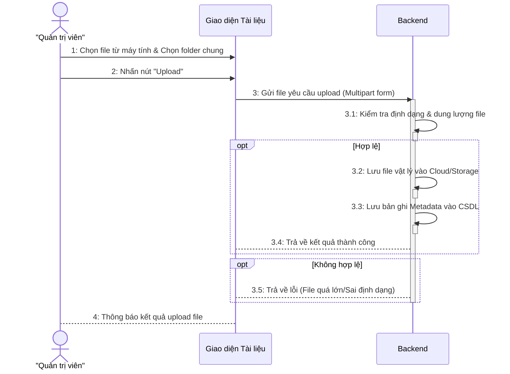

---

### 6. **XEM CHI TIẾT 1 BÀI VIẾT TRÊN WEB NGƯỜI DÙNG**

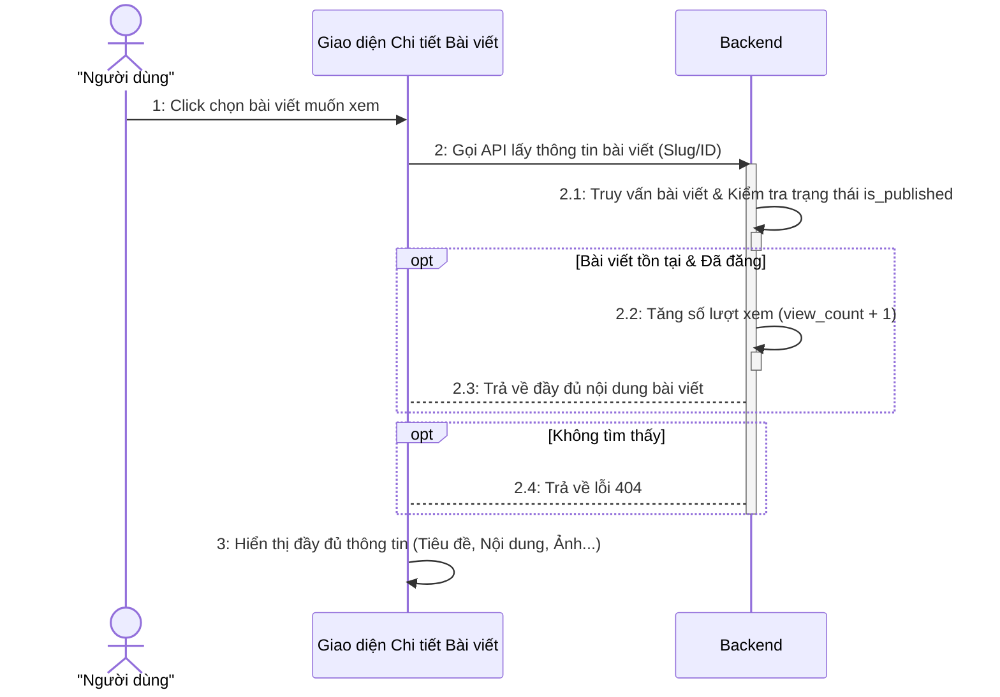

---

### 7. **TÌM KIẾM BÀI VIẾT TRÊN WEB NGƯỜI DÙNG**

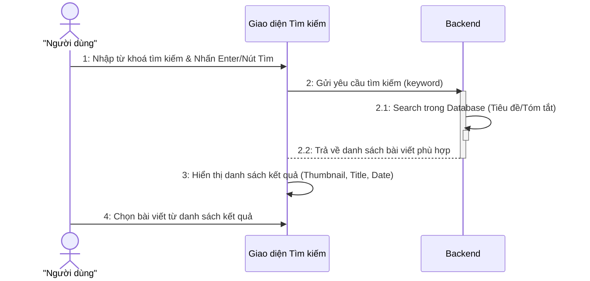

---

### 8. **TẠO BÀI VIẾT MỚI (CHI TIẾT NGHIỆP VỤ)**

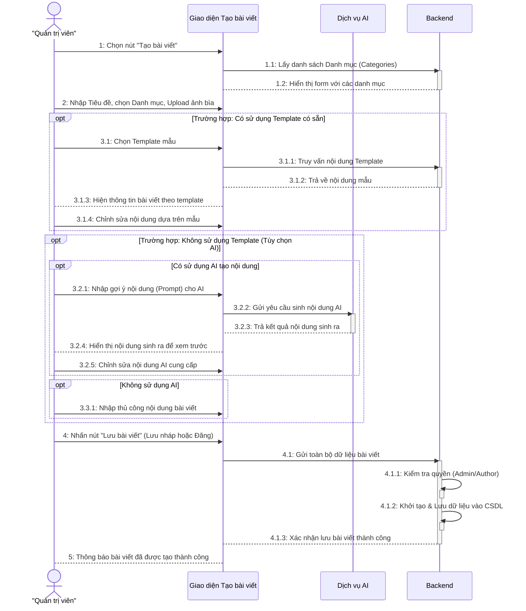

---

### 9. **ĐĂNG NHẬP (CHI TIẾT NGHIỆP VỤ)**

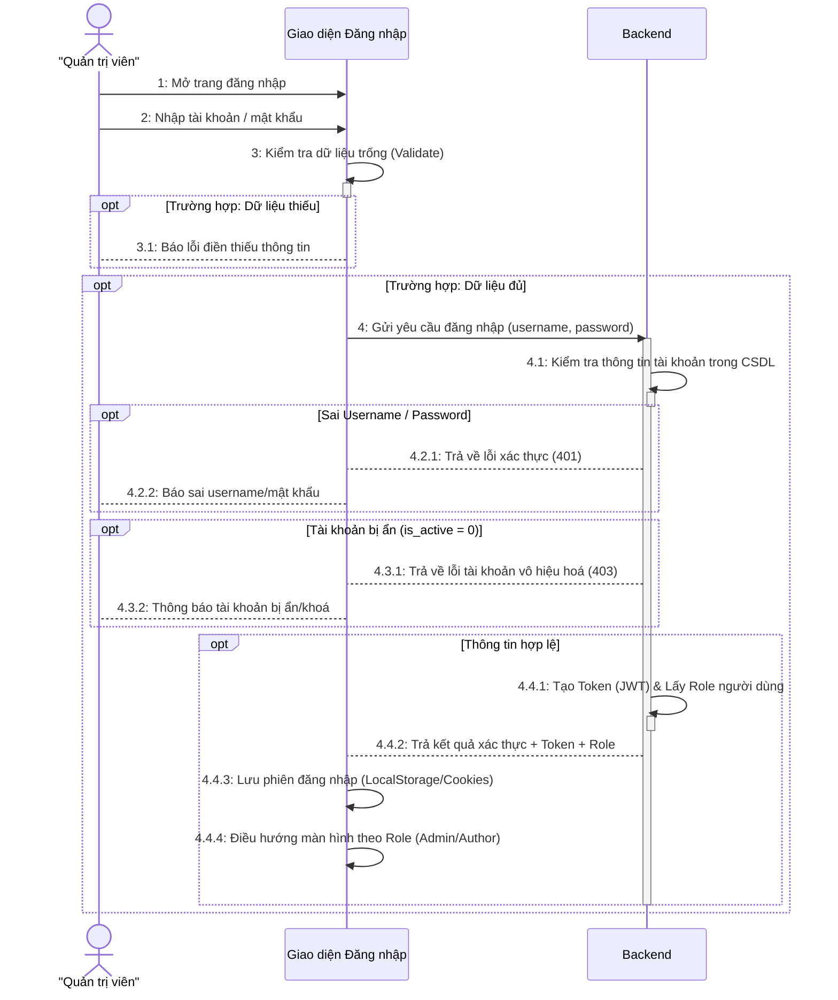

---

### 10. **TẠO DANH MỤC MỚI**

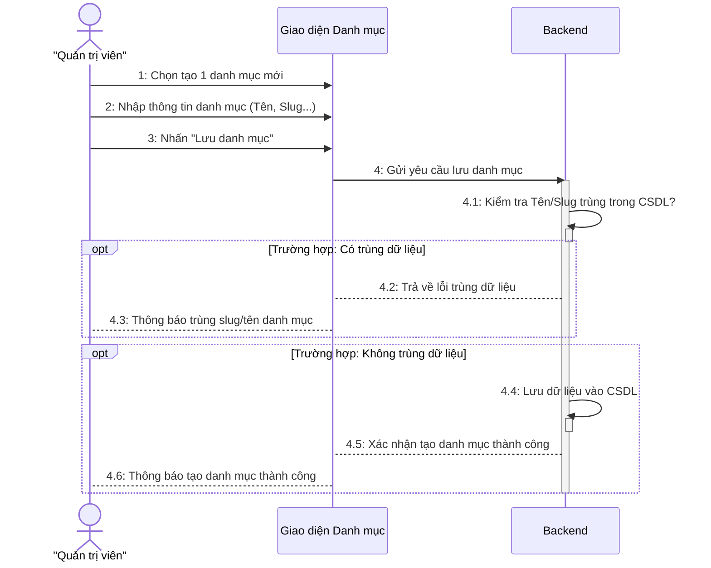

---

### 11. **TẠO CARD SỰ KIỆN HÀNG NĂM TRONG TIMELINE**

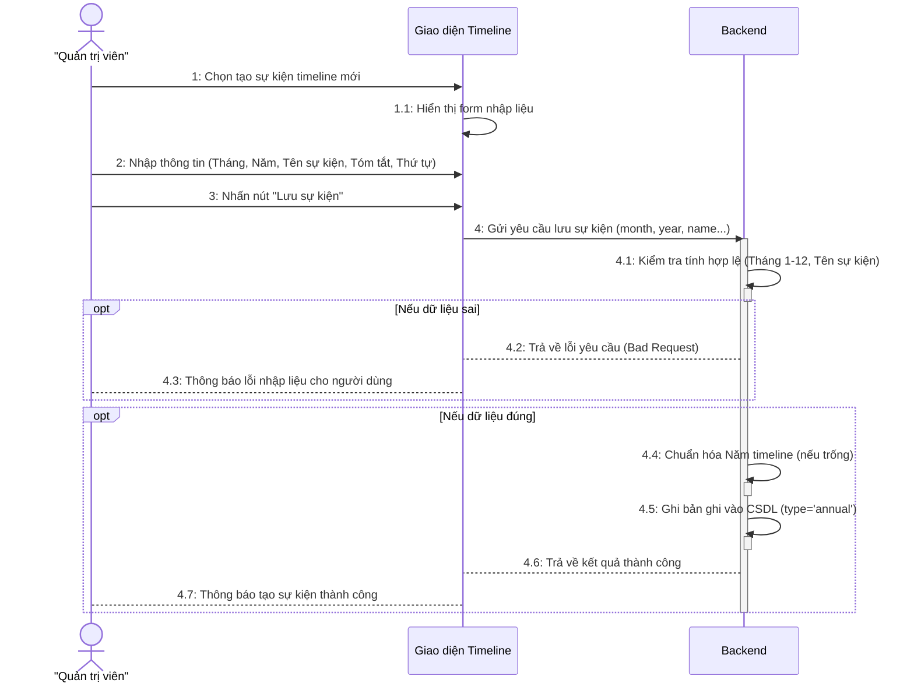

---

### 12. **DUYỆT 1 BÀI VIẾT**

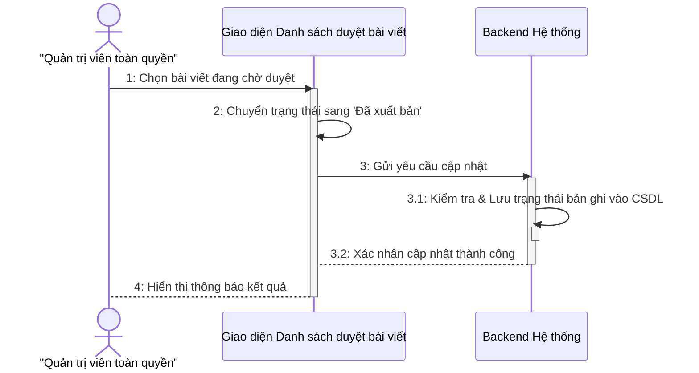
